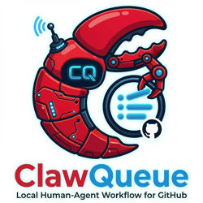
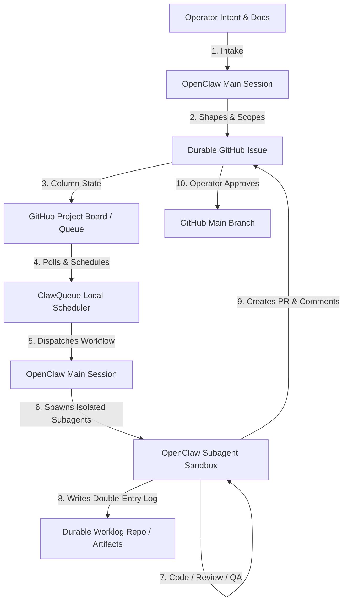

<div align="center">
  
</div>

<br/>

<div align="center">

[](.)
[](.)
[](.)
[](https://clawqueue.github.io/ClawQueue/)

</div>

<br/>

ClawQueue (CQ) is a **local human-agent workflow engine for GitHub**.

Combined with OpenClaw, CQ helps turn project context and operator intent into durable GitHub issues, then dispatches local agents to execute, report, and improve the work through reviewable GitHub history.

CQ is intentionally small: **GitHub holds the durable work contract, OpenClaw helps shape the work, your machine runs the workers, and policy stays in markdown/config you can edit while using it.**

CQ works in two very practical modes:
- **operate your own company/project** with your own profile, agents, boards, and worklog
- **contribute to an external/open-source project through your fork** by creating a project-specific CQ profile from the upstream repo’s README/docs/contribution rules, then routing issue-driven agent work into reviewed PRs

> [!WARNING]
> CQ is a trusted local operator tool. It shells out to local CLIs, starts agent processes, and expects the operator to control the machine, GitHub token, project boards, and notification channel.

## At a Glance

| Question | Short answer |
|---|---|
| **What is it?** | A local control loop that turns project context and human intent into GitHub issues, agent execution, artifacts, and PR-ready outcomes |
| **Where does work live?** | GitHub issues, boards, labels, comments, artifacts, and review history |
| **Where does context live?** | In OpenClaw/profile workspaces, markdown policy, local config, and issue history |
| **What runs work?** | OpenClaw subagents (primary local runtime and execution sandbox) |
| **Who is it for?** | A trusted operator or small team that wants GitHub-native agent work without a hosted PM layer |
| **What is it not?** | A SaaS workflow product, public bot, secure multi-tenant executor, or fake “AI company OS” |

**Use CQ when you want:**

- human ideas and project context to become durable, reviewable GitHub work
- GitHub Projects to remain the visible queue and review surface
- local execution with operator-controlled secrets, approvals, and context
- profile-specific agents/modes without forking the core workflow
- a system that is easy to inspect, patch, and reshape while it is running
- a structured local workflow for contributing features/fixes to an external or open-source GitHub project through your fork
- OpenClaw to amplify rough operator intent into scoped issues, then CQ to carry those issues through execution and review

## Use Cases

### 1. Operate your own company or project

Use CQ with OpenClaw to absorb your project mission, docs, priorities, and current discussion into scoped GitHub work, then run your own agent team against your repos, boards, profiles, and worklog. This is the default operating model for internal product, growth, ops, research, and review work.

### 2. Contribute to an external or open-source project

Use CQ as a local contribution pipeline for a repo you want to improve. OpenClaw reads the upstream project context; CQ makes the resulting work durable, queued, executable, and reviewable:

1. fork the target repo
2. create a project-specific CQ profile from the upstream README, docs, roadmap, and contribution rules
3. shape desired work into GitHub issues on your fork
4. let CQ dispatch local agent work against that project context
5. review the result and open a PR upstream

This gives you a durable GitHub-native agent workflow even when you do not “own the company” behind the repo.

### 3. Run a chief-of-staff workflow for GitHub work

Use OpenClaw to sharpen messy ideas, project goals, and half-formed feature requests into scoped issues; use CQ to route the work to specialist agents and keep artifacts/review history in GitHub instead of leaving everything trapped in chat.

Start with the [docs](https://clawqueue.github.io/ClawQueue/), especially [Getting started](https://clawqueue.github.io/ClawQueue/start/getting-started) and the [operator workflow](https://clawqueue.github.io/ClawQueue/guide/operator-workflow).

> [!TIP]
> **Using OpenClaw?** Give your OpenClaw assistant [`docs/guide/operator-workflow.md`](docs/guide/operator-workflow.md) and say: “Install ClawQueue for this repo/profile, then explain back how the CQ process works before enabling automation.” That file is the best handoff document for a new OpenClaw installation because it covers the operating model, GitHub queue, agent routing, manual test run, and scheduler install.

## How CQ Fits



The intended operating loop is:

1. **Intake:** OpenClaw reads the relevant project context, current conversation, and operator intent.
2. **Scoping:** A human or a chief-of-staff assistant turns that messy intent into a scoped, structured GitHub issue.
3. **Queueing:** GitHub Issues and Projects provide the shared queue, audit trail, and visible board state.
4. **Scheduling:** The ClawQueue scheduler scans eligible issues, resolves labels to specific profiles, and dispatches the task.
5. **Execution (The OpenClaw Subagent Sandbox):** ClawQueue starts an OpenClaw main session, which leverages OpenClaw's native orchestration engine to spawn isolated, task-specific subagents. These subagents carry out the execution (writing code, drafting documents, analyzing data) within secure, sandboxed environments.
6. **Artifacting:** The subagent commits its deliverables (artifacts) to a separate Git worklog repository, creating a double-entry accounting trail of all agent actions.
7. **Delivery & Review:** The subagent posts an execution report as a GitHub comment, opens a PR, transitions the board card to `In Review`, and awaits human sign-off.

*Note: While ClawQueue can fall back to external CLI backends (like Claude Code or Codex), its primary execution substrate is the OpenClaw subagent runtime, ensuring high security, local-first tool execution, and rich cross-agent collaboration.*

For multiple people, each person should run their own CQ/OpenClaw instance against the same GitHub boards, with their own accounts, secrets, approvals, and local context. By default CQ only dispatches `Todo` items. A deployment can opt into other dispatch statuses in its profile policy, but Review is usually a human/operator lane.

## Why CQ Exists

Human-agent work gets safer and easier to improve when intent, execution, and review are separated cleanly.

OpenClaw is good at understanding messy conversation, project context, and operator goals. GitHub is good at durable issues, boards, comments, PRs, and review history. CQ connects those two worlds with a small local control loop: shape the idea, queue the issue, dispatch the agent, preserve the result, review the outcome.

If OpenClaw, Claude Code, Codex, or a local machine breaks, times out, or changes, the work contract still lives in GitHub: issue text, labels, board state, comments, artifacts, and review history.

That makes CQ useful for operator-shaped teams and solo contributors who want agent-amplified GitHub work without burying their company workflow or open-source contribution process inside one chat, one PM surface, or one vendor runtime.

## Adjacent Systems

CQ overlaps with several agent-workflow tools, but it makes a different bet: **keep GitHub as the durable workflow surface and keep the human-agent loop local, small, and operator-shaped.**

| System | Main strength | CQ difference |
|---|---|---|
| **[OpenAI Symphony](https://github.com/openai/symphony)** | Project-board tasks can launch isolated autonomous implementation runs | CQ focuses earlier and around the run: intake, profile policy, label routing, local context, and durable GitHub review history |
| **[Paperclip](https://paperclip.ing)** | A broader AI-company control plane | CQ is narrower on purpose: GitHub holds the durable work contract; OpenClaw shapes intent upstream; CQ carries issues through local execution and review |
| **[Multica](https://multica.ai)** | A dedicated PM surface for human+agent teams | CQ avoids adding another PM layer; issues, boards, labels, and comments stay repo-native |
| **[gstack](https://gstack.lol/)** | A coding-centric workflow stack | CQ is less runtime- and task-specific: it can route non-coding work and does not require one workflow surface |

The practical difference is resilience and operator control. Policy lives in markdown, routing lives in config, private IDs stay local, work lives in GitHub, and the operator can evolve the system without rebuilding a platform around it.

**In one line:** CQ is the GitHub-native control loop for human-agent work: understand the project, shape the idea, create the issue, dispatch the agent, and review the result without letting the work disappear into the runtime.

---


## Deployment Profiles

CQ core should stay generic. Company-specific mission, agent souls, routing, and deployment settings should live in a profile folder or private deployment repo. See the [profiles guide](https://clawqueue.github.io/ClawQueue/guide/profiles).

Recommended shape:

```text
profiles/<company-or-team>/
  COMPANY.md
  agents/
  modes/
  config/
  secrets/   # ignored/private by default
```

This keeps CQ easy to upgrade while private company context can evolve in its own git history.

Generated reports and research artifacts should not be mixed into product/profile PR branches. CQ defaults to ignored local artifacts under `.clawqueue/boards`; companies that want artifact history in git should use a second repo dedicated to worklog/artifacts. See the [artifacts guide](https://clawqueue.github.io/ClawQueue/guide/artifacts).

CQ works with the default GitHub Project status flow out of the box: `Todo`, `In Progress`, `Done`, with dispatch defaulting to `Todo` only. Teams that want a richer human-agent workflow can extend the board manually in the GitHub UI with statuses such as `Inbox`, `Review`, and `Blocked`. Bootstrap a new GitHub Project board with `python3 scripts/bootstrap_project_board.py`.

---

## Architecture

The `scripts/scheduler.py` entry point delegates to a small package:

| Layer | Module | Responsibility |
|---|---|---|
| Operator status | `scripts/status.py` | Show active worker, recent decisions, attempt counts, and queued issues |
| Profiles/roadmap | `profiles/` + GitHub issues/projects | Keep company/team identity separate from CQ core and track public work as issues |
| Workflow policy/config | `clawqueue.config` + `config/company_workflow_policy.md` | Load repo-owned routing rules, ignored private overrides, and env vars |
| Tracker/project board client | `clawqueue.tracker` | Read GitHub issues, cache ProjectV2 board state, move status columns, assign/unassign issues |
| Dispatcher/workflow engine | `clawqueue.dispatcher` | Sweep stale work, enforce locks/throttles/attempt limits, pick tasks, dispatch workers |
| Agent runner | `clawqueue.runner` | Build mode prompts and launch agents via `openclaw`, `claude` (Claude Code CLI), or `codex` |
| Notification/activity | `clawqueue.notifications`, `clawqueue.activity` | Optional Telegram ask flow, best-effort completion notices, and local session activity checks |

Run the scheduler from cron, launchd, or another local scheduler:

```bash
python3 scripts/scheduler.py
```

On macOS, keep the repo in a non-privacy-protected path such as `~/ClawQueue`; cron may be denied access to `~/Documents` or `~/Desktop`.

---

## How Work Moves

```
OpenClaw (chief of staff) — reads project docs, repo context, and human intent
  → drafts structured GitHub issues
  → human reviews and publishes issue to the queue

GitHub issue in Todo
  → scheduler entrypoint scans configured repos/projects
  → dispatcher picks an eligible issue
  → labels resolve to a mode and agent
  → issue is assigned and moved to In Progress
  → runner starts the selected backend:
      openclaw         →  openclaw agent --agent <name>
      claudecode       →  claude -p <prompt> --print
      codex            →  codex -p <prompt>
      antigravity      →  agy -p <prompt> --dangerously-skip-permissions (headless CLI)
      antigravity-gui  →  python3 scripts/run_antigravity_gui.py --prompt <prompt> (CDP-driven desktop app via AG2R)
  → worker comments completion  <!-- clawqueue:done -->
  → CQ moves completed work to Review and closes the GitHub issue
  → human reviews while closed, then either drags Review → Done or reopens in Review for revision
  → reopened Review issue is eligible for a reviewer/revision agent
```

ClawQueue decides **which issue** gets picked and **which backend** launches it. OpenClaw is usually upstream as the context-rich intake/chief-of-staff layer; when using the `openclaw` backend, it is also the runtime that launches the named specialist agent. With `claudecode` or `codex`, the runner passes the full task prompt directly to that CLI.

An issue is eligible when it is **open, unassigned, on a configured board status listed in that project’s `dispatch_statuses` policy**, under the attempt cap, and not blocked by locks, throttles, activity gates, or quota guards. The default policy is `Todo` only.

Recommended human-in-the-loop convention: closed + Review means “deliverable ready, human review pending, scheduler must wait”; open + Review means “changes requested, scheduler may revise”; closed + Done means “accepted/final.”

---


## Agents vs Modes

CQ uses both persistent agents and mode prompts:

- **Agents** are durable role specialists, especially when using the OpenClaw backend. A profile can define agents such as `ceo`, `cto`, and `cmo`, each with its own identity, soul, workspace, and memory.
- **Modes** are task lenses. They frame how a task should be approached and are injected into worker prompts. Modes are especially important for direct `claude` or `codex` runner calls, which should be treated as mostly stateless unless that runner provides its own session layer.
- **Issues** are the shared memory of work. CQ should not rely on one chat transcript or one agent's private memory to know what happened.

Recommended operating model: the main assistant acts as chief of staff for intake and synthesis, using project context to improve rough human ideas before they become issues; CQ dispatches those issues to persistent profile agents for execution; modes frame each task; issue comments and profile memory preserve the outcome.

---

## Agent Team

Six named agents cover the full company operating surface:

<table>
<thead>
<tr>
<th>Label</th>
<th>Agent</th>
<th>Default model</th>
<th>Mode prompt</th>
<th>Scope</th>
</tr>
</thead>
<tbody>
<tr>
<td><code>ceo</code></td>
<td><strong>CEO</strong></td>
<td>gpt-5.5 (Codex)</td>
<td><a href="modes/ceo.md">modes/ceo.md</a></td>
<td>Mission leverage, scope review, strategic approval</td>
</tr>
<tr>
<td><code>cto</code></td>
<td><strong>CTO</strong></td>
<td>gpt-5.5 (Codex)</td>
<td><a href="modes/cto.md">modes/cto.md</a></td>
<td>Architecture, product, engineering plans, automation</td>
</tr>
<tr>
<td><code>dev</code> / <code>engineer</code></td>
<td><strong>Dev</strong></td>
<td>gpt-5.5 (Codex)</td>
<td>—</td>
<td>Implementation, scripts, data pipelines, fixes</td>
</tr>
<tr>
<td><code>cmo</code></td>
<td><strong>CMO</strong></td>
<td>gpt-5.5 (Codex)</td>
<td><a href="modes/cmo.md">modes/cmo.md</a></td>
<td>Growth, demand, campaigns, sales, social, partnerships</td>
</tr>
<tr>
<td><code>researcher</code></td>
<td><strong>Researcher</strong></td>
<td>gpt-5.5 (Codex)</td>
<td><a href="modes/researcher.md">modes/researcher.md</a></td>
<td>Market, customer, technical, scientific, and evidence research</td>
</tr>
<tr>
<td><code>reviewer</code></td>
<td><strong>Reviewer</strong> <em>(optional)</em></td>
<td>gpt-5.5 (Codex)</td>
<td><a href="modes/reviewer.md">modes/reviewer.md</a></td>
<td>Code review, risk, brand safety, approval gates — skipped when no Review column is configured</td>
</tr>
</tbody>
</table>

Priority order: `ceo › cto › reviewer › cmo › researcher › dev › engineer`

- No mode label → routes to `cto`
- `complex` label → escalates to `ceo`
- All agents write a retrieval note to `memory/notes/` after each task

---

## Routing

Issue labels select the operating mode. Labels choose the cognitive mode; config resolves that role to one or more concrete OpenClaw agents. Board status decides whether the issue is ready.

Profiles should keep shared policy generic (`ceo`, `cto`, `cmo`, etc.) and map those roles to local runtime agent ids with `routing.agent_roles`, for example `"cmo": ["manobot-cmo", "stratobot-cmo"]`. CQ picks the first configured candidate. If an issue needs a specific runtime agent, add a label like `agent:manobot-cmo` to override role resolution directly for that issue.

### Example Issues

<details>
<summary><strong>Growth / marketing task</strong></summary>

```markdown
Title: Draft a campaign brief for a new data product
Labels: cmo, marketing

Objective:
Draft a campaign brief for a clearly defined customer segment.

Acceptance criteria:
- Define audience and value proposition
- Draft campaign message
- Suggest 3 channels
- Include success metrics
- Mark external copy as draft-only
```

Routes to the CMO agent via `modes/cmo.md`.

</details>

<details>
<summary><strong>Research / data task</strong></summary>

```markdown
Title: Evaluate data quality for a customer-facing report
Labels: researcher, data-research

Objective:
Compare a sample dataset against credible references and summarize quality risks.

Acceptance criteria:
- Identify comparison sources
- Explain method, assumptions, and units where relevant
- Report uncertainty, limitations, and quality concerns
- Recommend the next validation step
```

Routes to the Researcher agent via `modes/researcher.md`.

</details>

<details>
<summary><strong>Engineering task</strong></summary>

```markdown
Title: Add an active-worker status command
Labels: engineer, engineering

Objective:
Show the current active issue, repo, PID, and start time from local state.

Acceptance criteria:
- Handles missing or corrupt state
- Compile check passes
- No unrelated refactor
```

Routes to the Dev agent.

</details>

### Project Boards

CQ is board-name agnostic. A deployment can define any ProjectV2 boards in its profile/config; the scheduler only needs the project number, ProjectV2 IDs, status field ID, and status option IDs.

A vanilla setup usually starts with 2-4 boards like these:

| Example board key | Example title | Purpose |
|---|---|---|
| `CORE` | Core Taskboard | CQ operations, orchestration, bugs, documentation, and scheduler work |
| `GROWTH` | Growth / GTM | Sales, marketing, campaigns, partnerships, social, and conversion work |
| `PRODUCT` | Product / Engineering | Product planning, implementation, architecture, technical debt, and review |
| `DATA` | Data / Research | Research, analytics, data quality, reports, experiments, and evidence gathering |

Keep these as examples, not CQ defaults. Real company board keys, titles, repo mappings, and ProjectV2 IDs belong in `profiles/<company-or-team>/config/workflow_policy.md`, ignored private config, or environment overrides.

---

## Runner Backends

ClawQueue supports five execution backends. Set `runner_backend` in the policy file or `CLAWQUEUE_RUNNER_BACKEND` env var.

| Backend | Value | Command | Auth needed | Best for |
|---|---|---|---|---|
| OpenClaw | `openclaw` (default) | `openclaw agent --agent <name> --deliver ...` | OpenClaw configured on PATH | Full OpenClaw harness: memory, delivery, multi-step agents |
| Claude Code CLI | `claudecode` | `claude -p <prompt> --print --output-format text` | Local `claude` CLI auth; may be API-key based or subscription/session based depending on the operator setup | Direct Claude execution when the operator has explicitly configured and approved that CLI use |
| Codex CLI | `codex` | `codex -p <prompt>` | Local `codex` CLI auth; may be OpenAI API-key based or subscription/session based depending on the installed CLI/account | Direct Codex/OpenAI execution; often useful for implementation and code-heavy tasks |
| Antigravity CLI | `antigravity` | `agy -p <prompt> --dangerously-skip-permissions` | Local Google AI `agy` CLI on PATH | Headless, standalone terminal execution via Google's Go-based agent CLI |
| Antigravity 2.0 GUI + AG2R | `antigravity-gui` | `python3 scripts/run_antigravity_gui.py --prompt <prompt>` | Antigravity desktop app open (CDP port 9000) & AG2R server running (HTTPS port 3000) | Live visual inspection on your Mac screen, continuous conversation history, and remote tool permission approval via mobile/web PWA |

When using `claudecode`, `codex`, or `antigravity`, the runner builds a full task prompt (including the mode instructions and acceptance criteria) and passes it directly to the CLI. OpenClaw is not involved at runtime.

### Google Antigravity 2.0 & AG2R Interactive GUI Setup

The `antigravity-gui` backend is a unique, high-productivity integration. It allows you to watch ClawQueue's agent execution in real time inside the native **Antigravity 2.0 Electron desktop application** on your Mac. When paired with the **AG2R** remote client, you can inspect progress, see file diffs, and approve tool execution permissions directly from your phone or any browser!

#### Session & Project Preservation
By default, the `antigravity-gui` backend targets a project folder in the Antigravity sidebar named **`clawqueue`** (case-insensitive).
* **Context Reuse:** If an active conversation is already open in the `clawqueue` project, it will automatically append the new task to the **same session**, allowing the agent to preserve its continuous history, workspace context, and memory across multiple ClawQueue tasks!
* **Fallback:** If no conversations exist, or the folder is empty, it automatically clicks the nested `+` icon button to initialize the first chat thread under `clawqueue`.

#### Step-by-Step Running Guide

1. **Launch the Antigravity 2.0 Desktop App with CDP enabled:**
   ```bash
   open -a Antigravity --args --remote-debugging-port=9000
   ```
2. **Start the AG2R Remote Server:**
   ```bash
   cd /Users/manos/Code/ag2r
   npm install
   node server.js
   ```
   *(Note: The server runs over secure HTTPS on `https://localhost:3000`. You will need to bypass the self-signed certificate warning in your browser by clicking "Advanced" -> "Proceed").*

3. **Deploy a Cloudflare Tunnel for Remote Mobile Control (Optional):**
   ```bash
   cloudflared tunnel --url https://localhost:3000 --no-tls-verify
   ```
   Open the printed `trycloudflare.com` URL on your phone's browser, accept the cert warning, and add it to your Home Screen to use it as a PWA with Push Notifications for tool permission approvals!

4. **Run ClawQueue with the GUI Backend:**
   ```bash
   CLAWQUEUE_RUNNER_BACKEND=antigravity-gui python3 scripts/scheduler.py --profile weatherxm
   ```

> [!CAUTION]
> Direct CLI and GUI backends inherit whatever account, subscription, API key, local session, quota, and terms apply to that tool. Do not assume a personal subscription is allowed for automated/background use. Check the relevant terms and your organization’s policy before running CQ unattended against those backends.

```bash
# Use Antigravity Headless CLI directly
CLAWQUEUE_RUNNER_BACKEND=antigravity python3 scripts/scheduler.py

# Use Antigravity Interactive GUI with AG2R Bridge
CLAWQUEUE_RUNNER_BACKEND=antigravity-gui python3 scripts/scheduler.py
```

---

## Company Setup

Minimal path:

1. Install/configure OpenClaw if using the `openclaw` runner backend.
2. Clone CQ.
3. Configure workflow policy in `config/company_workflow_policy.md`.
4. Put private IDs/secrets in `config/clawqueue.private.json` or environment variables.
5. Test manually:

```bash
python3 scripts/status.py --no-queue
python3 scripts/scheduler.py
```

6. Install the scheduler, preferably launchd on macOS:

```bash
python3 scripts/install_launchd.py --repo "$HOME/ClawQueue" --policy config/company_workflow_policy.md
```

Environment variables are escape hatches for local overrides. They are not the primary config mechanism for a single company instance.

---

## Configuration

Config loads in this order — later layers override earlier ones:

```
config/company_workflow_policy.md                    ← tracked generic default
profiles/<profile>/config/workflow_policy.md         ← tracked/shared profile policy when --profile is used
config/clawqueue.private.json                        ← gitignored generic private config
profiles/<profile>/config/clawqueue.private.json     ← gitignored per-user profile overrides
CLAWQUEUE_* env vars                                 ← rare one-off overrides
```

```bash
# generic/single-policy setup
cp config/clawqueue.private.example.json config/clawqueue.private.json

# shared profile setup
cp profiles/<profile>/config/clawqueue.private.example.json \
  profiles/<profile>/config/clawqueue.private.json
python3 scripts/status.py --profile <profile>
python3 scripts/install_launchd.py --repo "$HOME/ClawQueue" --profile <profile>
```

For multiple schedulers on one Mac, give each LaunchAgent its own label and wrapper name. The installer now writes per-label runtime isolation by default:

```bash
python3 scripts/install_launchd.py \
  --repo "$HOME/ClawQueue" \
  --profile weatherxm \
  --label com.clawqueue.weatherxm \
  --wrapper-name clawqueue-weatherxm.sh
```

Defaults are `~/.openclaw/tmp/clawqueue/<label>` for `CLAWQUEUE_STATE_DIR`, `~/.local/share/clawqueue/<label>` for `CLAWQUEUE_LOG_DIR`, and the active profile/policy config directory for `CLAWQUEUE_PRIVATE_CONFIG_FILE`. Override them explicitly with `--state-dir`, `--log-dir`, and `--private-config` when a deployment needs fixed paths.

### Minimum Local Setup

- `gh` authenticated with access to configured repos and ProjectV2 boards
- Real repo names in private config or `CLAWQUEUE_PRIMARY_REPO` / `CLAWQUEUE_EXTRA_REPOS`
- Real ProjectV2 IDs and status option IDs for board status updates
- For `openclaw` backend: `openclaw` on PATH (or set `CLAWQUEUE_OPENCLAW_COMMAND`), and OpenClaw agents configured for `ceo`, `cto`, `dev`, `cmo`, `researcher`, `reviewer`
- For `claudecode` backend: `claude` CLI on PATH with an auth method explicitly approved for this CQ use case; API-key and subscription/session-backed setups have different policy and quota implications
- For `codex` backend: `codex` CLI on PATH with an auth method explicitly approved for this CQ use case; API-key and subscription/session-backed setups have different policy and quota implications
- For `antigravity` backend: `agy` CLI on PATH with valid configuration
- For `antigravity-gui` backend: Antigravity 2.0 Desktop app installed on `/Applications/` and running with CDP port `9000` (`open -a Antigravity --args --remote-debugging-port=9000`), and `ag2r` cloned, dependencies installed, and running on port `3000`
- Python available locally. Docs target Python 3.11+, but CQ may still run on older macOS system Python if your installed feature set is compatible; verify with the compile/test commands below.

Telegram, activity gates, quota tuning, mode URL overrides, and fallback maps are optional.

### Environment Variables

| Variable | Used by | Purpose |
|---|---|---|
| `CLAWQUEUE_POLICY_FILE` | config | Override tracked policy file path |
| `CLAWQUEUE_PRIVATE_CONFIG_FILE` | config | Override ignored private config path |
| `CLAWQUEUE_PRIMARY_REPO` | tracker | Primary issue repo, e.g. `owner/clawqueue` |
| `CLAWQUEUE_EXTRA_REPOS` | tracker | Comma-separated extra repos to scan |
| `CLAWQUEUE_PROJECTS_JSON` | tracker | JSON override for project IDs, field IDs, status options |
| `CLAWQUEUE_GITHUB_ASSIGNEE` | tracker | GitHub login to assign while a worker is active |
| `CLAWQUEUE_STATE_DIR` | dispatcher | Runtime state dir; defaults under system temp |
| `CLAWQUEUE_LOG_DIR` | dispatcher | Decision/log data dir; launchd installer defaults to a per-label directory under `~/.local/share/clawqueue` |
| `CLAWQUEUE_OPENCLAW_COMMAND` | runner | Agent CLI command; default `openclaw` |
| `CLAWQUEUE_DELIVER_CHANNEL` | runner | OpenClaw worker delivery channel; use `none`/`off` to avoid chat delivery dependency |
| `CLAWQUEUE_COMPLETION_NOTIFY_CHANNEL` | notifier | Best-effort completion notification channel, e.g. `telegram` |
| `CLAWQUEUE_COMPLETION_NOTIFY_TARGET` | notifier | Completion notification target, or `last-telegram` to reuse this instance’s most recent Telegram direct chat |
| `CLAWQUEUE_MODES_DIR` | runner | Local mode prompt directory |
| `CLAWQUEUE_MODES_BASE_URL` | runner | Fallback raw URL for mode prompts |
| `CLAWQUEUE_ALL_OPUS` | routing | Route implementation modes through `ceo` when true |
| `CLAWQUEUE_MODE_TO_AGENT_JSON` | routing | JSON map overriding mode-to-agent routing |
| `CLAWQUEUE_AGENT_PROVIDER_JSON` | quota | JSON map for provider quota checks |
| `CLAWQUEUE_AGENT_FALLBACK_JSON` | quota | JSON map for exhausted-provider fallback agents |
| `CLAWQUEUE_DAILY_WARN_REMAINING_PCT` | quota | Warn when provider daily/primary quota is at or below this remaining percent; default `10` |
| `CLAWQUEUE_WEEKLY_WARN_REMAINING_PCT` | quota | Warn when provider weekly/secondary quota is at or below this remaining percent; default `20` |
| `CLAWQUEUE_DAY_STOP_REMAINING_PCT` | quota | Stop/reroute when daily/primary remaining quota is at or below this percent; default `5` |
| `CLAWQUEUE_WEEKLY_STOP_REMAINING_PCT` | quota | Stop/reroute when weekly/secondary remaining quota is at or below this percent; default `0` (disabled) |
| `CLAWQUEUE_REVIEWER_AUTO_CLOSES_ISSUE` | runner | Whether reviewer agents close issues after passing review |
| `CLAWQUEUE_MAX_ATTEMPTS_PER_ISSUE` | dispatcher | Per-issue dispatch attempt cap |
| `CLAWQUEUE_MIN_RUN_INTERVAL_MIN` | dispatcher | Throttle between successful dispatches |
| `CLAWQUEUE_IDLE_TIMEOUT_MIN` | activity | Require this many idle minutes before dispatching |
| `CLAWQUEUE_USER_ACTIVE_GATE_MIN` | activity | Skip or ask when recent user activity is detected |
| `CLAWQUEUE_DECISION_LOG_RETENTION_DAYS` | dispatcher | Days to keep in `~/.local/share/clawqueue/decisions.jsonl` |
| `CLAWQUEUE_TELEGRAM_BOT_TOKEN` | notifier | Telegram bot token for ask flow |
| `CLAWQUEUE_TELEGRAM_CHAT_ID` | notifier | Telegram chat ID for ask flow |
| `OPENCLAW_HOME` | config | Base OpenClaw directory; default `~/.openclaw` |
| `OPENCLAW_WORKSPACE` | config | OpenClaw workspace; used for modes and memory files |

---

## Private Project Config

GitHub ProjectV2 mutations need node IDs that must not be committed. Put them in `config/clawqueue.private.json`:

```json
{
  "github": {
    "assignee": "your-github-login"
  },
  "projects": {
    "MT": {
      "project_id": "<github-project-node-id>",
      "field_id": "<github-project-status-field-id>",
      "status_options": {
        "todo": "option-id-for-todo",
        "in_progress": "option-id-for-in-progress",
        "done": "option-id-for-done"
      }
    }
  }
}
```

Use `CLAWQUEUE_PROJECTS_JSON` for the same data in CI or a secret-managed runtime.

---

## Lightweight Operator Controls

CQ stays local-first and solo-operator friendly, but it mirrors the useful state back to GitHub:

- one managed progress comment per issue, marked with `<!-- clawqueue:progress -->`
- tiny worker result comments, marked with `<!-- clawqueue:result -->` and `<!-- clawqueue:done -->`
- issue comments as simple commands: `/cq diagnose`, `/cq run`, `/cq retry`, `/cq pause`
- issue/comment text is treated as untrusted task data in worker prompts

Workers should not directly close issues or move board status. They report a small result object and CQ applies final state:

```json
{
  "status": "done",
  "summary": "Brief operator-facing summary.",
  "files_changed": ["relative/path-or-github-url"],
  "needs_review": true
}
```

Supported commands:

| Command | Effect |
|---|---|
| `/cq diagnose` | Update the managed comment with CQ blockers and next action; `/cq status` is a compatibility alias |
| `/cq run` | Ensure the issue is on the board and queued in `Todo` |
| `/cq retry` | Remove `cq:paused`/`cq:failed`/`cq:blocked`, unassign, reset attempts, requeue |
| `/cq pause` | Add `cq:paused`, unassign, skip until retry |

CQ-owned state labels: `cq:paused`, `cq:failed`, `cq:blocked`.

CQ deliverable labels:

- `cq:artifact` — agent-side label for a durable Markdown/report/spec deliverable. Workers avoid product/source mutations unless the issue explicitly asks for them. Generated artifacts go to the configured local/worklog artifact destination, not into the code/profile PR branch.
- `cq:change` — agent-side label for a source/content/config/docs change deliverable with verification evidence.

Use exactly one deliverable label when possible. If missing, CQ infers one from the issue title/body and adds the inferred label before dispatch.

Company profile safety can restrict `cq:change` to trusted GitHub issue authors:

```json
"safety": {
  "change_author_allowlist": ["github-user", "operator-alt"]
}
```

When the allowlist is set, CQ blocks unauthorized `cq:change` issues with `cq:blocked` before dispatch. `cq:artifact` remains suitable for broader intake.

## Runtime Behavior

Each scheduler run:

1. Trims the decision log to the configured retention window
2. Sweeps stale `In Progress` board items
3. Exits if another dispatcher or worker is active
4. Applies the throttle and attempt-count limits
5. Reads open issues from configured repos
6. Picks the highest-priority eligible issue from each project’s configured `dispatch_statuses`; issues with explicit `depends on Issue #N` / `depends on #N` lines wait until those dependencies have a completion result after their latest retry
7. Defaults to `Todo` only; profiles can opt into other statuses explicitly
8. Checks provider quota via `codexbar` when available, including Codex daily/primary and weekly/secondary remaining quota windows
9. Warns when configurable remaining-quota thresholds are crossed, then stops/reroutes if stop thresholds are crossed
10. Assigns the issue, moves it to `In Progress`, and starts the selected agent

Runtime state lives in `CLAWQUEUE_STATE_DIR` (default: temp dir named `clawqueue`; launchd installs use a per-label directory).
Decision log persists under `CLAWQUEUE_LOG_DIR` (default: `~/.local/share/clawqueue`; launchd installs use a per-label directory).

```bash
# Inspect recent decisions, active worker, attempt counts, queued issues
python3 scripts/status.py
```

---

## Safety Posture

ClawQueue assumes a **trusted operator on a trusted local machine**. It shells out to `gh`, `codexbar`, and `openclaw`. Do not expose it as a public service without authentication, authorization, command sandboxing, audit logging, and a proper secret manager.

Agents are internal team assistants. External-facing work is **draft-only until a human approves it**. Human approval is required before:

- Publishing, sending, pricing, or promising anything externally
- Outbound sales, partnerships, or official communications
- Commercial terms, legal/financial/regulatory claims
- Official roadmap commitments or company authority

Tracked files must not contain bot tokens, chat IDs, ProjectV2 node IDs, personal absolute paths, or private assignees. Run a local secret scan before sharing.

---

## Design System
ClawQueue ships a compact design system for the operator UI — deep navy, precise typography, and an amber accent for agent activity.
Open [`index.html`](index.html) in a browser for the full design system hub — colors, typography, spacing, and all components.

---

## Development

```bash
# Compile-check all Python
python3 -m py_compile scripts/scheduler.py clawqueue/*.py

# Run unit tests
python3 -m unittest

# Inspect before committing
git diff --stat && git diff
```
